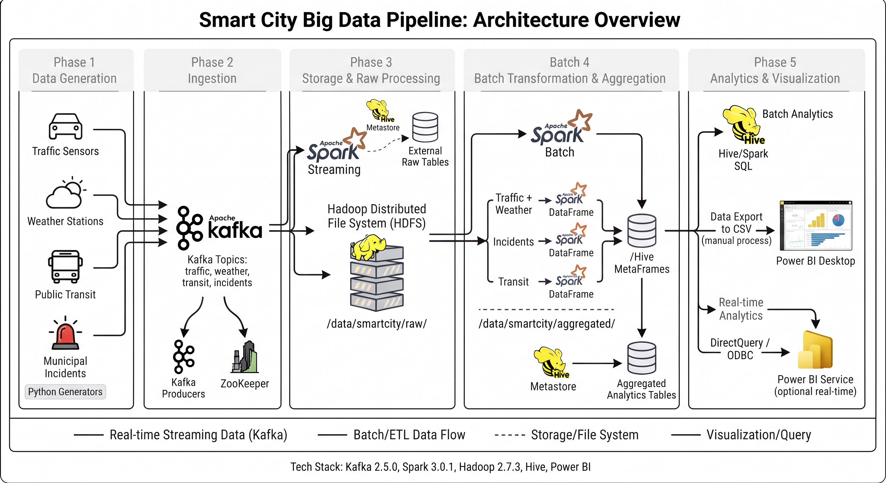

# Smart City Big Data Pipeline

**Real-Time Urban Analytics — Ingestion, Processing, and Visualization at City Scale**

---

## Team / Contributors


- Mohamed Khairy Eid
- Roshdy Yahia Roshdy
- Beshoy Saeed Kamel
- Raghdaa Ayman Ata
---

## Architecture Diagram



---

## Core Tech Stack

- **OS:** CentOS (execution VM)
- **Ingestion:** Apache Kafka 2.5.0 + ZooKeeper
- **Storage:** Hadoop HDFS 2.7.3
- **SQL Layer:** Apache Hive 2.1.0
- **Processing:** Apache Spark 3.0.1 (Structured Streaming + Batch)
- **Language:** Python 3 (`kafka-python`, standard library)
- **Visualization:** Power BI Desktop

---

## End-to-End Architecture & Data Flow

**Phase 1 — Data Generation**
Four Python scripts simulate real-time traffic, weather, transit, and incident data as timestamped, zone/route-tagged JSON.

**Phase 2 — Ingestion (Kafka)**
Each generator feeds a matching Kafka producer, publishing to one of four topics (`smartcity-traffic`, `smartcity-weather`, `smartcity-transit`, `smartcity-incidents`).

**Phase 3 — Storage & Raw Processing (HDFS + Hive)**
A Spark Structured Streaming job consumes all four topics, parses them against explicit schemas, and writes continuous Parquet output to `/data/smartcity/raw/` on HDFS. Hive external tables expose this raw data for SQL querying.

**Phase 4 — Batch Transformation (Spark)**
A Spark batch job reads the raw Parquet and produces three aggregated datasets — traffic/weather correlation by zone+hour, incident summary by zone+severity, and transit summary by route — written to `/data/smartcity/aggregated/` and exposed via additional Hive tables.

**Phase 5 — Analytics & Visualization**
Aggregated Hive tables are exported to CSV, transferred to Windows, and modeled in Power BI Desktop to build the final interactive dashboard.

---

## Repository Directory Structure

```
smart-city-bigdata-pipeline/
│
├── README.md
├── .gitignore
│
├── docs/
│   ├── architecture.md
│   ├── architecture.png
│   ├── data-schemas.md
│   ├── kafka-topics.md
│   └── hive-table-definitions.md
│    
│
├── data-generation/
│   ├── traffic_generator.py
│   ├── weather_generator.py
│   ├── transit_generator.py
│   └── incident_generator.py
│
├── ingestion/
│   ├── producers/
│   │   ├── traffic_producer.py
│   │   ├── weather_producer.py
│   │   ├── transit_producer.py
│   │   └── incident_producer.py
│   ├── consumers/
│   │   └── validation_consumer.py
│   └── kafka/
│       └── topic_setup.sh
│
├── processing/
│   └── spark_jobs/
│       ├── stream_ingest_to_hdfs.py
│       └── batch_aggregate.py
│
├── storage/
│   ├── hdfs/
│   │   └── directory_layout.md
│   └── hive/
│       ├── create_raw_tables.hql
│       ├── create_agg_tables.hql
│       └── export_to_csv.hql
│
├── visualization/
│   ├── powerbi/
│   │   └── smart_city_dashboard.pbix
│   └── exported_data_samples/
│       └── README.md
│
└── scripts/
    ├── setup_hdfs.sh
    └── finalize_csv_exports.sh
```

---

## Quick Start / Setup Guide

**1. Start core services (VM terminal)**
```
start-dfs.sh
zookeeper-server-start.sh -daemon $KAFKA_HOME/config/zookeeper.properties
kafka-server-start.sh -daemon $KAFKA_HOME/config/server.properties
```

**2. Create Kafka topics and HDFS directories (one-time)**
```
bash ingestion/kafka/topic_setup.sh
bash scripts/setup_hdfs.sh
```

**3. Run producers (one terminal per script)**
```
python3 ingestion/producers/traffic_producer.py
python3 ingestion/producers/weather_producer.py
python3 ingestion/producers/transit_producer.py
python3 ingestion/producers/incident_producer.py
```

**4. Run Spark Structured Streaming (own terminal, keep running)**
```
spark-submit --packages org.apache.spark:spark-sql-kafka-0-10_2.12:3.0.1 \
  processing/spark_jobs/stream_ingest_to_hdfs.py
```

**5. Create Hive raw tables**
```
hive -f storage/hive/create_raw_tables.hql
```

**6. Run Spark batch aggregation (after enough raw data has accumulated)**
```
spark-submit processing/spark_jobs/batch_aggregate.py
hive -f storage/hive/create_agg_tables.hql
```

**7. Export aggregates to CSV for Power BI**
```
hive -f storage/hive/export_to_csv.hql
bash scripts/finalize_csv_exports.sh
```

Transfer the resulting CSVs from `~/smartcity_exports/` to Windows (Git or VMware drag-and-drop) and open in Power BI Desktop.
